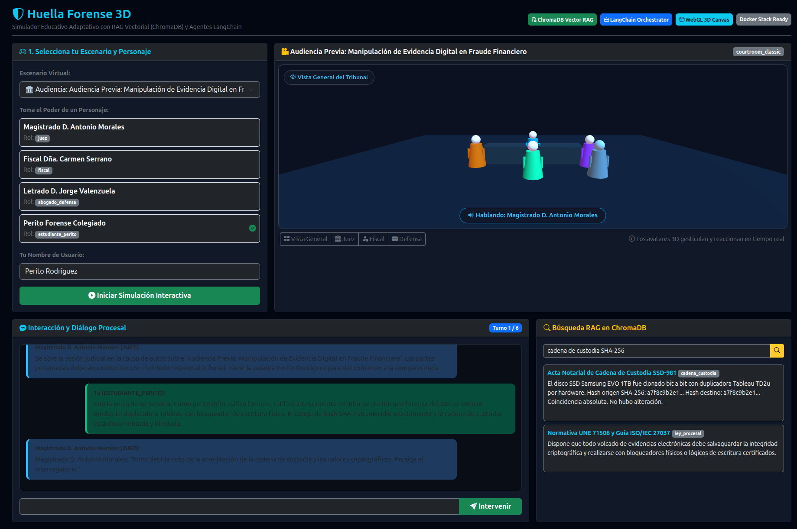
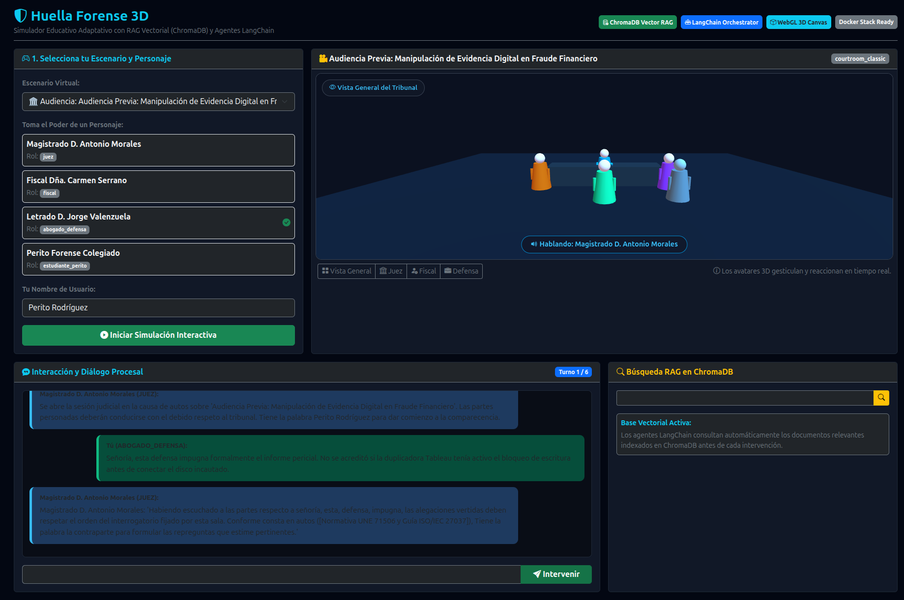
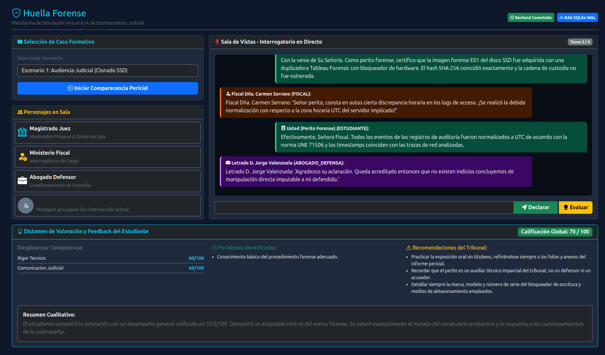
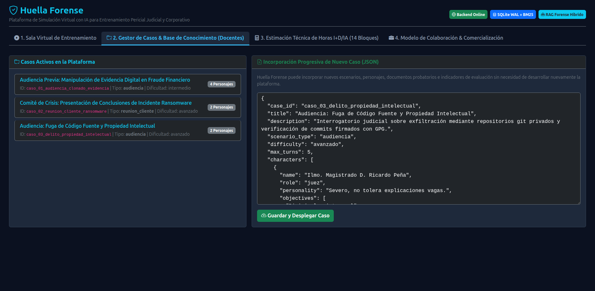
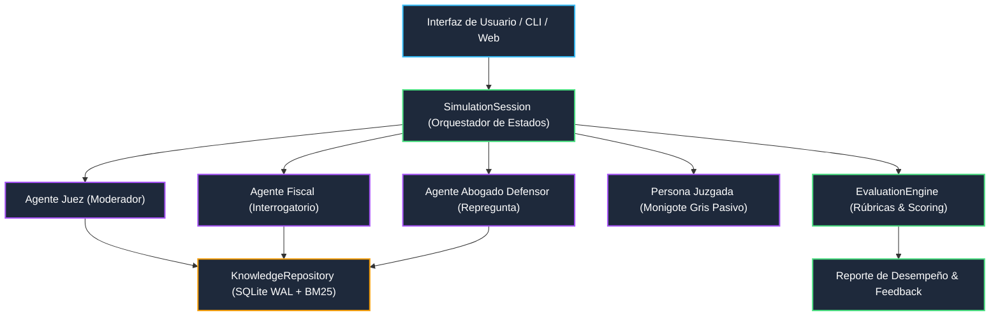

# Plataforma de Simulación Virtual de Entrenamiento Forense

[](https://python.org)
[](https://fastapi.tiangolo.com)
[](https://docs.pydantic.dev)
[](file:///home/wisrovi/Documents/demo/tests)
[](LICENSE)

Plataforma de entrenamiento pericial virtual con inteligencia artificial diseñada para **Huella Forense**, conforme a todas las especificaciones y necesidades descritas en el documento de requisitos del proyecto.

---

## 🏛️ Autoría y Responsabilidad Técnica
- **Autor:** William Steve Rodriguez Villamizar (Wisrovi)
- **Cargo:** Principal Software Engineer & AI Solutions Architect
- **Email Oficial:** [wisrovi.rodriguez@gmail.com](mailto:wisrovi.rodriguez@gmail.com)
- **Web Oficial:** [https://wisrovi.dev](https://wisrovi.dev)
- **ORCID:** [0009-0005-0710-1861](https://orcid.org/0009-0005-0710-1861)
- **Filiación:** wisrovi-suit AI Research Initiative, Badajoz, Spain

---

## 🚀 Resumen de la Solución Implementada

La solución cubre íntegramente los 12 puntos de requerimientos del cliente:

1. **Escenario 1 (Simulación de Audiencia Judicial):** Interrogatorio pericial con roles dinámicos de Magistrado Juez, Fiscal, Abogado de la Acusación, Abogado Defensor y el acusado como monigote gris pasivo.
2. **Escenario 2 (Simulación de Reunión con Cliente):** Comité de crisis con Director General y CISO para explicación de incidente y reporte regulatorio (AEPD/RGPD).
3. **Entrenamiento y Funcionamiento de la IA (RAG Híbrido):** Repositorio SQLite WAL con búsqueda semántica y filtrado por niveles de confidencialidad de cada rol.
4. **Gestión Modular de Casos:** Sistema desacoplado `CaseManager` en JSON/YAML que permite incorporar nuevos casos sin modificar código fuente.
5. **Sistema de Valoración del Estudiante:** Motor analítico de evaluación multidimensional que genera calificaciones cuantitativas (0-100), feedback cualitativo, fortalezas, debilidades y análisis detallado turno a turno.
6. **Estimación Técnica I+D/IA (14 Bloques):** Análisis de esfuerzo presupuestado entre **420 y 645 horas** (10-12 semanas de desarrollo para MVP).
7. **Validación E2E en Navegador con MCP Chrome:** Verificación integral de la interfaz gráfica y flujo interactivo usando las herramientas de `chrome-devtools`.

---

## 📸 Demostración Visual (Validado con MCP Chrome DevTools)

### 1. Nuevo Simulador 3D Adaptativo con Three.js, ChromaDB Vector RAG y LangChain


### 2. Diálogos Dinámicos con LLM (Usuario como Abogado Defensor vs Tribunal e IA)


### 3. Sala Virtual de Audiencias e Interrogatorio Pericial


### 4. Gestor Docente de Casos e Incorporación Progresiva sin Tocar Código


---

## 📊 Arquitectura del Sistema



---

## ⚡ Inicio Rápido (Quickstart)

### 1. Ejecutar la Demostración Completa End-to-End
Ejecuta la simulación de audiencia, intervención pericial, réplica de los personajes y evaluación final automática:
```bash
python3 scripts/demo_simulation.py
```

### 2. Probar el Simulador Interactivo por Consola (CLI)
Permite participar como perito forense en vivo y responder las preguntas del juez y fiscal:
```bash
python3 -m huella_forense.cli.app
```

### 3. Ejecutar la Suite de Pruebas Automatizadas (Pytest)
```bash
python3 -m pytest tests/ -v
```

### 4. Iniciar el Servidor REST FastAPI
```bash
uvicorn huella_forense.web.api:app --reload --port 8000
```
La documentación interactiva Swagger estará disponible en: [http://localhost:8000/docs](http://localhost:8000/docs).

---

## 🗂️ Estructura del Repositorio

```text
├── docs/
│   ├── README.md
│   ├── arquitectura.md                 # Arquitectura detallada con diagramas Mermaid
│   └── estimacion_horas_id_ia.md       # Desglose de 14 bloques y 420-645 horas
├── huella_forense/
│   ├── README.md
│   ├── cli/                            # Aplicación CLI interactiva con Rich
│   ├── core/                           # CaseManager desacoplado en JSON
│   ├── data/                           # Casos preconfigurados y plantillas
│   ├── estimation/                     # Generador del informe de esfuerzo I+D/IA
│   ├── evaluation/                     # Motor de valoración y rúbricas pedagógicas
│   ├── knowledge/                      # Repositorio RAG forense (SQLite WAL + BM25)
│   ├── models/                         # Esquemas fuertemente tipados Pydantic v2
│   ├── scenarios/                      # Orquestador de agentes y máquina de estados
│   └── web/                            # API REST FastAPI
├── scripts/
│   ├── README.md
│   └── demo_simulation.py              # Script ejecutable de demostración integral
└── tests/
    ├── README.md
    └── test_huella_forense.py          # Pruebas automatizadas pytest (100% passed)
```

---

## 📄 Licencia
Este proyecto se distribuye bajo Licencia MIT.
