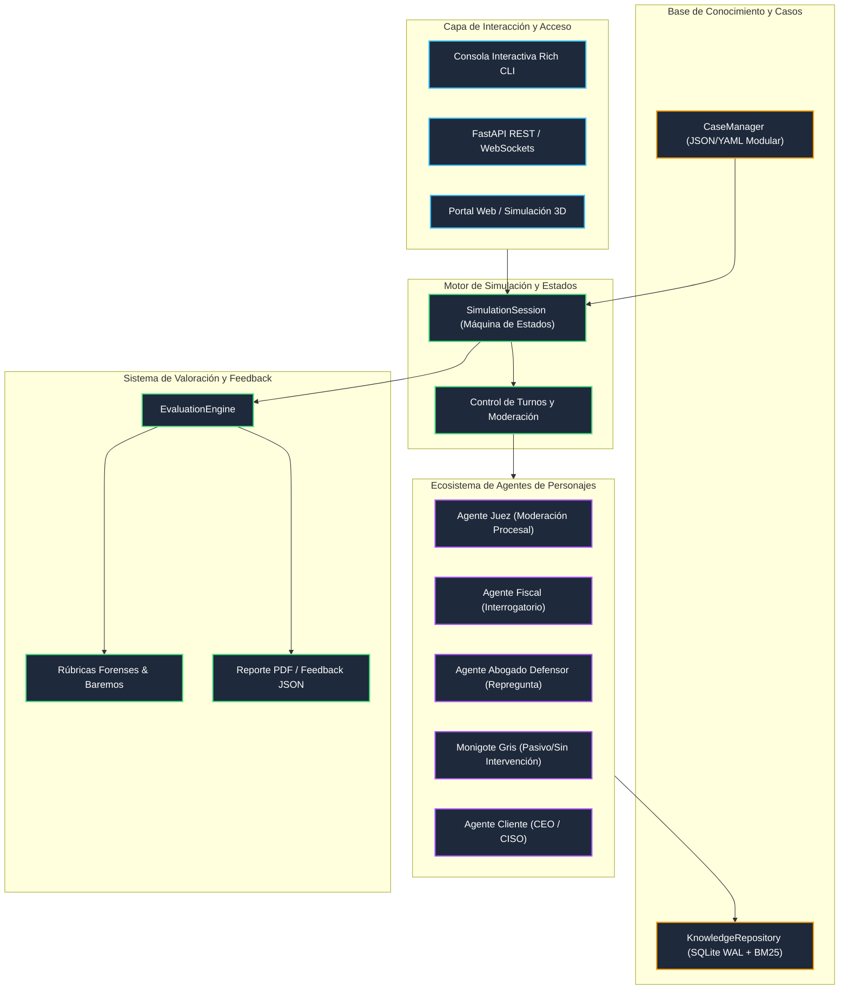

# Arquitectura Técnica - Plataforma de Simulación Virtual Huella Forense

## 1. Visión General de la Solución

La solución responde a la totalidad de las necesidades descritas en el pliego de requisitos de **Huella Forense**, implementando una arquitectura modular desacoplada basada en micro-componentes Python con soporte asíncrono, persistencia transaccional y orquestación inteligente de agentes.

## 2. Diagrama de Arquitectura de Flujo (Mermaid)

## 3. Componentes Principales

1. **Gestión de Casos sin Dependencia Técnica (`CaseManager`):**
   - Nuevos casos se incorporan mediante esquemas JSON/YAML validados con Pydantic.
   - Permite que Huella Forense cree cientos de casos con diferentes dificultades, evidencias y normativas sin alterar el código base.

2. **Base de Conocimiento Híbrida y RAG Forense (`KnowledgeRepository`):**
   - SQLite en modo WAL para persistencia ultrarrápida.
   - Búsqueda contextual con BM25 adaptado y filtrado estricto por tags de confidencialidad de cada rol.

3. **Orquestador de Personajes (`CharacterAgent`):**
   - Prompts de sistema especializados para el Juez, Fiscal, Abogado Defensor y Cliente.
   - Soporte para roles pasivos visuales (el *monigote gris* exigido en el requerimiento para la persona juzgada).

4. **Sistema de Valoración Multidimensional (`EvaluationEngine`):**
   - Puntuación 0-100 ponderada por indicadores configurables.
   - Detección de conceptos clave (cadena de custodia, hashes SHA-256, bloqueadores de escritura).
   - Detección y penalización de titubeos e inseguridades procesales.
   - Feedback cualitativo, fortalezas, puntos de mejora y análisis turno a turno.
