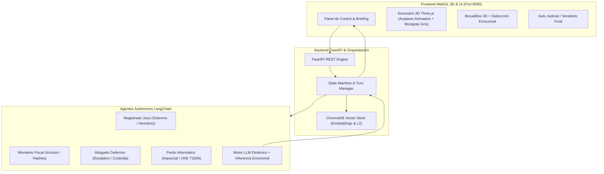

# 🏛️ Huella Forense 3D RPG - Simulador Educativo Procesal Adaptativo

Plataforma inmersiva de simulación de juicios orales y comités de crisis forenses con **Agentes Autónomos LangChain**, **Base de Datos Vectorial ChromaDB (RAG)** y **Renderizado 3D WebGL con Three.js**.

---

## 🎯 Arquitectura de la Solución



---

## 🚀 Características Clave Implementadas

1. **Modalidad RPG (Toma de Poder de Personaje):**
   - El estudiante puede elegir el rol a encarnar (**Perito Forense Colegiado**, **Letrado Defensor**, **Ministerio Fiscal**, **Magistrado Juez**, etc.).
   - Los roles restantes son asumidos de forma autónoma por agentes de IA coordinados por **LangChain**.
   - Incluye al acusado silencioso en el banquillo mediante la figura visual del **"monigote gris"**.

2. **Diálogos Dinámicos con Emociones y Deducción Psicológica:**
   - **Cero respuestas prefijadas**: Todos los diálogos son generados dinámicamente según personalidad, rol, objetivo procesal, turno e información recuperada.
   - **Etiquetas de Emoción y Postura:** Los personajes exhiben estados emocionales visibles (`[Solemne & Ecuánime]`, `[Incisivo]`, `[Escéptico & Agresivo]`, `[Atento & Aprobatorio]`).
   - **Deducción de Pensamientos Internos:** El estudiante visualiza pensamientos no verbalizados de los actores para inferir credibilidad procesal o detectar vulnerabilidades en el interrogatorio.

3. **Escenario 3D WebGL (Three.js):**
   - Avatares procedurales con gesticulación de brazos, balanceo durante el habla (*lip-sync* procedural) y bocadillos de diálogo 3D proyectados en el espacio de la sala.
   - Conmutación dinámica de cámaras cinematográficas (Vista General, Juez, Fiscal, Defensa).

4. **RAG Vectorial con ChromaDB:**
   - Base de datos vectorial persistente con actas notariales de cadena de custodia, normativas (UNE 71506, ISO/IEC 27037) e informes de triaje forense.
   - Búsqueda semántica instantánea integrada en la interfaz.

5. **Resolución Procesal y Veredicto Judicial:**
   - Turnos rotativos procesales que concluyen con la deliberación del Magistrado y emisión de un **Auto Judicial / Sentencia Final** con métricas de rigor técnico, coherencia procesal y validez de custodia.

---

## 🐳 Despliegue con Docker y Docker Compose

### 1. Iniciar el servicio completo
```bash
docker compose up --build -d
```
El simulador estará disponible de inmediato en:
👉 **`http://localhost:8080/`**

### 2. Ejecutar localmente sin Docker
```bash
# Instalar dependencias
pip install -r requirements.txt

# Iniciar servidor
python3 -m uvicorn platform_simulator.api.server:app --host 127.0.0.1 --port 8080
```

---

## 🧪 Pruebas Automatizadas
```bash
pytest -v tests/test_platform_simulator.py
```
